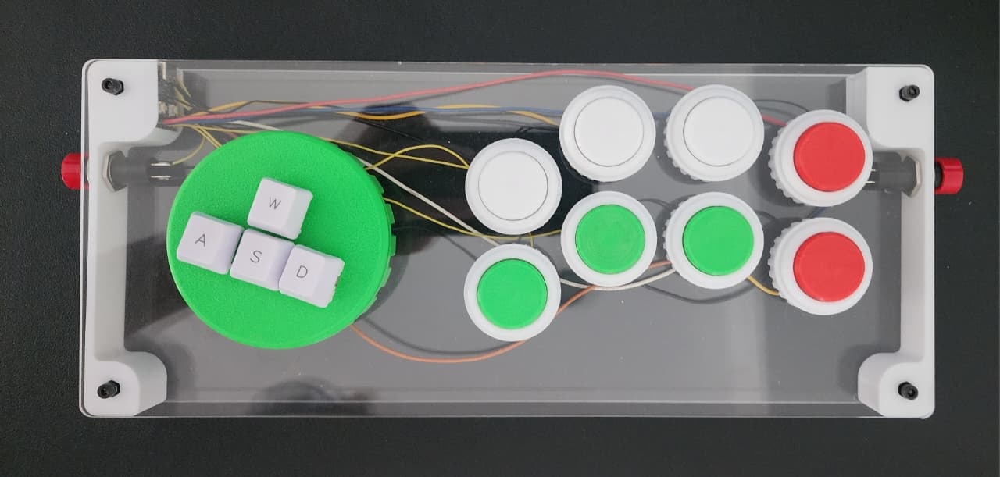
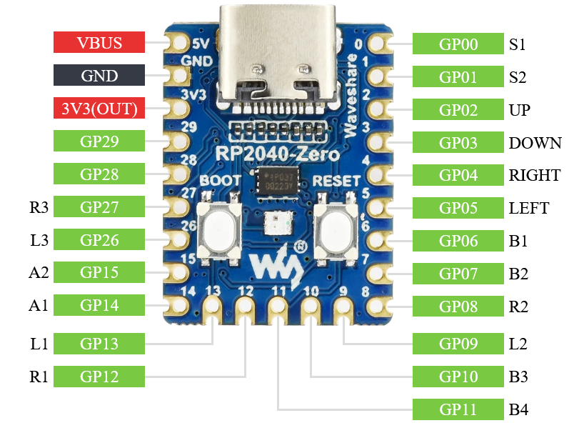
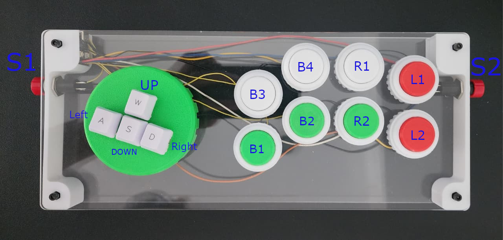

## Leverless Fighting Pad

Diseño abierto de un control estilo leverless para juegos de pelea. Este proyecto permite a cualquiera fabricar su propio “fighting stick” sin palanca, usando piezas impresas en 3D y una placa frontal cortada en láser.

El objetivo de este proyecto es usar cosas que puedas conseguir facilmente, en caso de tener diferentes insertos o botones no dudes en modificar los archivos.

### Características
- **Formato leverless**: entradas de dirección con botones (estilo WASD) para precisión.
- **Archivos listos para fabricar**: modelos `.stl` para impresión 3D y una placa frontal `.svg` para corte láser.
### Compatibilidad de hardware y firmware

- **Placa recomendada:** [Waveshare RP2040-Zero](https://www.waveshare.com/rp2040-zero.htm)
  - Este diseño está pensado específicamente para la placa RP2040-Zero por su tamaño compacto, bajo costo y compatibilidad con USB HID.
- **Firmware sugerido:** [GP2040-CE](https://gp2040-ce.info/)
  - Firmware open source ampliamente utilizado para controles de pelea, compatible con la RP2040-Zero y fácil de flashear.

> **Nota:** Puedes adaptar el diseño para otras placas RP2040 o microcontroladores compatibles, pero la plantilla y los soportes están optimizados para la Waveshare RP2040-Zero. En caso de querer adaptarlo usar el archivo SidePanelFS.FCStd (FreeCAD) para modificarlo a la la placa que desees.

### Contenido del repositorio
- `ASDW.stl`: Cluster direccional WASD
- `ASDW NUT.stl`: Pieza/complemento para sujeción con tuerca o refuerzo del tablero WASD.
- `SidePanelFS-PCB.stl`: panel lateral (carcasa/soporte) pensado para alojar una Waveshare RP2040-Zero.
- `LaserPlate.svg`: placa frontal para corte láser (acrílico, aluminio o madera) con distribución de botones. Para la placa trasera utilize la misma plantilla eliminando los agujeros para los botones AWSD y el resto de los botones.
- `LICENSE`: Licencia del proyecto.

Nota: Los nombres de archivo pueden referirse a variantes/partes específicas. Ajusta la orientación y tolerancias según tu impresora y el hardware que utilices.

### Materiales necesarios (sugerido)
- Botones de 30 mm (para estos utilicé el modelo creado por [Finz en Makerworld](https://makerworld.com/en/models/1530382-30mm-arcade-buttons-obsn-30-drop-in-alternative#profileId-1604861) para adaptar switches estilo Cherry MX).
- Microcontrolador [Waveshare RP2040-Zero](https://www.waveshare.com/rp2040-zero.htm).
- Cables suficientes para conectarlo.
- Tornillería M3 (tornillos, standoffs M3 nylon hexagonales).
- Superficie de placa frontal (acrílico 3 mm recomendado) para el corte láser.
- Patas/gomas antideslizantes (opcional).

### Herramientas
- Impresora 3D FDM o servicio de impresion.
- Cortadora láser o servicio externo para `LaserPlate.svg`.
- Destornilladores, llaves para M3.
- Cautin y estaño para soldar, al igual que flux para facilitar el proceso.

### Impresión 3D (recomendaciones)
- Material: PLA o PETG.
- Altura de capa: 0.2 mm.
- Perímetros: 3.
- Relleno: 15% (Gyroid/Rectilinear).
- Soportes: Si.

Ajusta holguras para los botones: los de 30 mm suelen requerir tolerancia de ~0.2–0.4 mm dependiendo de tu calibración.

### Corte láser para `LaserPlate.svg`
- Material recomendado: acrílico de 3 mm.
- Verifica el diámetro de los orificios de botones (30 mm) y los de tornillería (M3) antes de cortar.
- Escala 1:1. Comprueba que tu software no aplique cambios de DPI al importar el SVG.

### Ensamblaje básico
1. Imprime las piezas `ASDW.stl`, `ASDW NUT.stl` y `SidePanelFS-PCB.stl`.
2. Corta la placa frontal con `LaserPlate.svg` en el material elegido.
3. Inserta los botones en la placa frontal y fija con las tuercas impresas respectivas para mantenerlo fijo en este punto decide si quieres que las flechas esten rectas o en angulo.
4. Inserta los standoffs hexagonales en la pieza SidePanel, puede requerir un poco de fuerza, si usas diferentes insertos es recomendable usar unos que se puedan insertar con calor y usar el cautin para que entren en su lugar.
5. Atornilla la placa delantera para que al posicionar el microcontrolador puedas medir los cables al tamaño que sea necesario.
5. Flashea y configura el firmware (ver sección siguiente). Una vez ensamblado sera mas complicado presionar el boton de boot para flashear el firmware.
6. Monta el microcontrolador en su soporte temporalmente y realiza el cableado de cada botón a la controladora.

   

   
   
7. Usar un poco de silicona caliente para que el microcontrolador quede fijo en su soporte.
8. Prueba cada entrada para validar que se soldo de manera correcta yo utilice el siguiente [Gamepad Tester](https://hardwaretester.com/gamepad).
9. Una vez comprobado que todo esta funcionando atornilla la placa trasera y tu control esta terminado!

### Firmware y compatibilidad
- **GP2040-CE (RP2040)**: En el apartado de Downloads buscar la placa Waveshare RP2040-Zero para descargar el firmware mas reciente.
  - Sitio: [GP2040-CE](https://gp2040-ce.info)

Utiliza el siguiente pinout al momento de soldar las conneciones de cada switch [PINOUT](https://gp2040-ce.info/controller-build/wiring/#waveshare-rp2040-zero).
| GP2040-CE | XInput |
|-----------|--------|
| B1        | A      |
| B2        | B      |
| B3        | X      |
| B4        | Y      |
| L1        | LB     |
| L2        | LT     |
| R1        | RB     |
| R2        | RT     |
| S1        | Back   |
| S2        | Start  |

En caso de no querer usar la configuracion base mapea las entradas conforme a tu preferencia (p. ej., ASDW para direcciones y botones de acción en disposición estándar).

### Consejos de ergonomía
- Ajusta la separación entre filas de botones para comodidad de mano/antebrazo. En caso de querer tener el microcontrolador del lado derecho, recorrer los botones un poco a la izquierda para dejar espacio suficiente a los cables y simplificar el ensamble.
- Añade gomas antideslizantes en la base.

### Solución de problemas
- Los agujeros quedan justos o flojos: recalibra el flujo/escala de impresión o ajusta la tolerancia en el slicer.
- El SVG se importa con escala incorrecta: revisa DPI (usa 96 DPI como base) y confirma medidas con una regla en el software de corte.
- No detecta el dispositivo: prueba otro cable USB, verifica drivers y que el firmware exponga HID correctamente.

### Licencia
Este proyecto se distribuye bajo los términos de `LICENSE`. Revisa ese archivo para conocer tus derechos y obligaciones.

### Contribuciones
¡Se agradecen mejoras! Abre un issue o PR con:
- Descripción clara del cambio.
- Capturas/render si es un ajuste mecánico.
- Indicaciones de tolerancias o configuración recomendada.

---

Si construyes este control, comparte fotos y comentarios. ¡Disfruta tu leverless!

